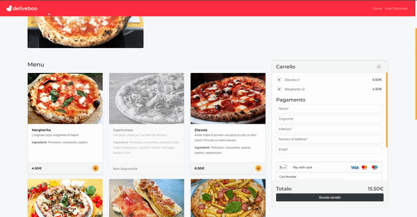

# Deliveboo

### Deliveboo is a food delivery web app that allows customers to order food from their favorite restaurant without registration, but entering only the data necessary for delivery (Credit card number, name, address). Restaurateurs can register in the platform and create, modify and delete dishes and see statistics based on their customers orders.

<hr>

## Setup

-   Start MAMP <br>
-   Create database <br>
-   Duplicate .env.example and rename it .env , insert info in .env (database name, port, mailer, ...)

<br>

```
composer install
npm install
php artisan key:generate
php artisan storage:link
php artisan cache:clear
php artisan config:cache
php artisan migrate --seed

```

<hr>

## Compiles and hot-reloads for development, run in server

```
npm run watch
php artisan serve

```

<hr>

## Register user

Login in the Dashboard with the following credentials:

-   Email: info@pizzeriamichele.it
-   Password: damichele

<hr>

## Contributors

<a href="https://github.com/ErJump">Giampiero Fedeli</a><br>
<a href="https://github.com/SamueleLettieri">Samuele Lettieri</a><br>
<a href="https://github.com/Antonius131">Antonio Mendetta</a><br>
<a href="https://github.com/amaljom">Amal Jomon</a><br>
<a href="https://github.com/markcaf">Marco Cafasso</a><br>

<hr>

## Screens


<br><br>

<br><br>

<br><br>

<br><br>

<br><br>

